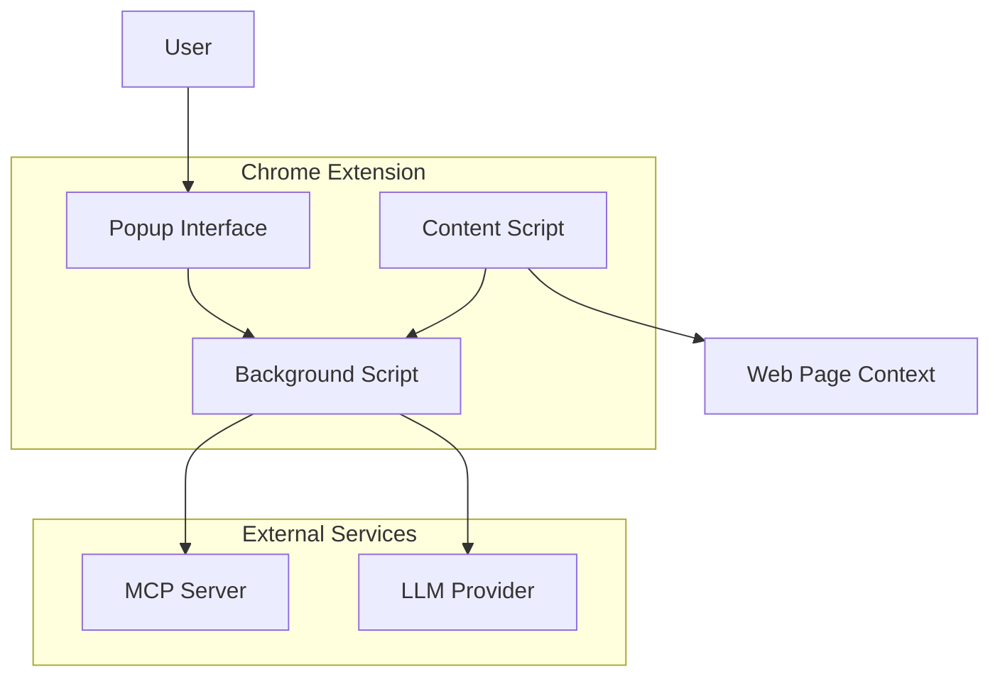

# 🤖 Chrome MCP Chat Extension

Uma extensão Chrome moderna e production-ready que integra **Model Context Protocol (MCP)** com **Large Language Models (LLMs)** diretamente no seu navegador.


## 🚀 **Recursos Principais**

### ✨ **Funcionalidades Core**
- 🔗 **Conexão MCP Real** - Conecta com servidores MCP via WebSocket
- 🧠 **Multi-LLM Support** - OpenAI, Anthropic, Ollama/Local, APIs customizadas
- ⚡ **Streaming em Tempo Real** - Respostas com streaming para melhor UX
- 🛠️ **Acesso a Ferramentas** - Execute ferramentas MCP através da IA
- 💾 **Configuração Persistente** - Settings salvos no Chrome Storage
- 🌐 **Integração Contextual** - Análise de texto selecionado em páginas

### 🎨 **Interface Moderna**
- 🌙 **Design Dark/Light** - Interface otimizada para longos períodos de uso
- 📱 **Layout Responsivo** - Funciona perfeitamente em diferentes tamanhos
- ⚡ **Animações Fluídas** - Transições suaves e feedback visual
- 🎯 **UX Intuitiva** - Configuração simples e uso imediato

### 🔒 **Segurança & Performance**
- 🔐 **Secrets Seguros** - API keys armazenadas com segurança
- 🚀 **Performance Otimizada** - Conexões persistentes e cache inteligente
- 🛡️ **Error Handling** - Tratamento robusto de erros e fallbacks
- 📊 **Monitoramento** - Health checks e reconexão automática

## 📦 **Instalação**

### **Opção 1: Instalação Manual (Recomendada)**

1. **Clone ou baixe este repositório:**
   ```bash
   git clone https://github.com/your-username/chrome-mcp-chat.git
   cd chrome-mcp-chat
   ```

2. **Abra o Chrome e vá para:**
   ```
   chrome://extensions/
   ```

3. **Ative o "Modo do desenvolvedor"** (canto superior direito)

4. **Clique em "Carregar sem compactação"** e selecione a pasta da extensão

5. **Pin a extensão** na barra de ferramentas para acesso rápido

### **Opção 2: Via Chrome Web Store (Em breve)**
*A extensão será publicada na Chrome Web Store após testes extensivos.*

## ⚙️ **Configuração Inicial**

### **1. Configurar LLM Provider**

#### **OpenAI:**
```
Provider: OpenAI
API Key: sk-...
Model: gpt-4
```

#### **Anthropic (Claude):**
```
Provider: Anthropic
API Key: sk-ant-...
Model: claude-3-sonnet-20240229
```

#### **Local/Ollama:**
```
Provider: Local
Base URL: http://localhost:11434/v1
Model: llama2
API Key: (opcional)
```

### **2. Configurar Servidor MCP (Opcional)**

```
URL do Servidor: ws://localhost:8080/mcp
API Key: (se necessário)
```

### **3. Configurações Avançadas**

- **Max Tokens:** 4000 (ajuste conforme necessário)
- **Temperatura:** 0.7 (criatividade vs precisão)
- **Streaming:** Habilitado (recomendado)

## 🎯 **Como Usar**

### **💬 Chat Básico**
1. Clique no ícone da extensão 🤖
2. Digite sua mensagem
3. Pressione Enter ou clique em 🚀

### **📝 Análise de Texto**
1. **Selecione texto** em qualquer página
2. **Clique com botão direito** → "Analisar com MCP Chat"
3. A extensão abrirá com o contexto da página

### **⌨️ Atalhos de Teclado**
- `Ctrl/Cmd + Shift + M` - Abrir chat
- `Ctrl/Cmd + Shift + A` - Analisar texto selecionado
- `Ctrl/Cmd + Enter` - Enviar mensagem no chat
- `Shift + Enter` - Nova linha na mensagem

### **🛠️ Usando Ferramentas MCP**
Quando conectado a um servidor MCP, você pode:
- **Executar comandos** através da IA
- **Acessar APIs** via ferramentas MCP
- **Integrar sistemas** externos
- **Automatizar tarefas** complexas

## 🔧 **Desenvolvimento**

### **Pré-requisitos**
- Chrome 88+ ou Chromium-based browser
- Node.js 16+ (para servidor MCP, se aplicável)
- Conhecimento básico de JavaScript/HTML/CSS

### **Estrutura do Projeto**
```
chrome-mcp-chat/
├── manifest.json          # Configuração da extensão
├── popup.html             # Interface principal
├── styles/
│   └── popup.css         # Estilos modernos
├── js/
│   └── popup.js          # Lógica principal
├── background.js          # Service worker
├── content.js            # Content script
├── icons/                # Ícones da extensão
└── README.md            # Esta documentação
```

### **Componentes Principais**

#### **🎨 Frontend (popup.html/css/js)**
- Interface de chat moderna
- Painel de configurações
- Indicadores de status em tempo real
- Suporte a streaming

#### **🔧 Background (background.js)**
- Gerenciamento de conexões MCP
- Persistência de configurações
- Health checks automáticos
- Context menus

#### **🌐 Content Script (content.js)**
- Integração com páginas web
- Extração de contexto
- Análise de texto selecionado
- Atalhos de teclado

### **APIs Integradas**

#### **LLM Providers:**
- ✅ OpenAI (GPT-3.5, GPT-4)
- ✅ Anthropic (Claude 3)
- ✅ Local/Ollama (Llama, CodeLlama, etc.)
- ✅ APIs customizadas

#### **MCP Protocol:**
- ✅ WebSocket connections
- ✅ Tool execution
- ✅ Context sharing
- ✅ Real-time messaging

## 🏗️ **Arquitetura**



### **Fluxo de Dados:**
1. **User Input** → Popup Interface
2. **Message Processing** → Background Script
3. **MCP Enhancement** → MCP Server (opcional)
4. **LLM Request** → Provider API
5. **Streaming Response** → User Interface

## 📡 **Servidor MCP (Exemplo)**

Crie um servidor MCP simples para testes:

```javascript
// server.js
const WebSocket = require('ws');

const wss = new WebSocket.Server({ port: 8080 });

wss.on('connection', (ws) => {
    console.log('🔗 Nova conexão MCP');
    
    ws.on('message', (message) => {
        const data = JSON.parse(message);
        console.log('📨 Mensagem recebida:', data);
        
        // Exemplo de resposta
        if (data.type === 'enhance_message') {
            ws.send(JSON.stringify({
                messageId: data.messageId,
                enhancedMessage: `Contexto MCP: ${data.message}`
            }));
        }
    });
});

console.log('🚀 Servidor MCP rodando na porta 8080');
```

## 🐛 **Debugging**

### **Console Logs**
- Abra `chrome://extensions/` → Detalhes → Inspecionar visões → Service Worker
- Console do popup: F12 na janela da extensão
- Content script: F12 na página web

### **Problemas Comuns**

#### **🔌 Conexão MCP Falha**
```
Erro: Timeout na conexão MCP
Solução: Verifique se o servidor está rodando na URL configurada
```

#### **🧠 LLM API Error**
```
Erro: HTTP 401 - Unauthorized
Solução: Verifique sua API key nas configurações
```

#### **📱 Popup Não Abre**
```
Problema: Extensão não aparece
Solução: Verifique se está pinada na barra de ferramentas
```

## 🔒 **Segurança & Privacidade**

### **🛡️ Medidas de Segurança:**
- ✅ API keys criptografadas no Chrome Storage
- ✅ Conexões HTTPS/WSS obrigatórias em produção
- ✅ Validação de entrada em todas as interfaces
- ✅ Sanitização de output para prevenir XSS
- ✅ Permissions mínimas necessárias

### **📋 Permissions Utilizadas:**
- `storage` - Salvar configurações
- `activeTab` - Acessar conteúdo da aba atual
- `scripting` - Injetar content scripts
- `host_permissions` - Conectar com APIs externas

### **🔐 Dados Coletados:**
- ❌ **Nenhum dado** é enviado para servidores próprios
- ✅ Dados ficam apenas no **seu navegador**
- ✅ Comunicação **direta** com LLMs e MCP
- ✅ **Você controla** todas as configurações

## 🚀 **Deployment & Distribuição**

### **Build para Produção:**
```bash
# Limpar arquivos de desenvolvimento
rm -rf .git/
rm -rf node_modules/

# Criar ZIP para Chrome Web Store
zip -r chrome-mcp-chat.zip . -x "*.git*" "node_modules/*" "*.DS_Store"
```

### **Chrome Web Store:**
1. Acesse [Chrome Web Store Developer Dashboard](https://chrome.google.com/webstore/devconsole/)
2. Faça upload do ZIP
3. Preencha metadados
4. Submit para revisão

## 🤝 **Contribuição**

### **Como Contribuir:**
1. **Fork** este repositório
2. **Create** uma branch: `git checkout -b feature/nova-funcionalidade`
3. **Commit** suas mudanças: `git commit -m 'Add nova funcionalidade'`
4. **Push** para a branch: `git push origin feature/nova-funcionalidade`
5. **Submit** um Pull Request

### **Guidelines:**
- ✅ **Código limpo** e bem documentado
- ✅ **Testes** para novas funcionalidades
- ✅ **Seguir** padrões estabelecidos
- ✅ **Production-ready** - sem simulações

## 📄 **Licença**

Este projeto está licenciado sob a **MIT License** - veja o arquivo [LICENSE](LICENSE) para detalhes.

## 🆘 **Suporte**

### **💬 Precisa de Ajuda?**
- 📧 **Email:** suporte@mcpchat.com
- 🐛 **Issues:** [GitHub Issues](https://github.com/your-username/chrome-mcp-chat/issues)
- 💬 **Discussions:** [GitHub Discussions](https://github.com/your-username/chrome-mcp-chat/discussions)

### **📚 Recursos Adicionais:**
- [Documentação MCP](https://modelcontextprotocol.io/)
- [Chrome Extension Development](https://developer.chrome.com/docs/extensions/)
- [OpenAI API Documentation](https://platform.openai.com/docs)
- [Anthropic API Documentation](https://docs.anthropic.com/)

---

## 🎉 **Agradecimentos**

- **MCP Protocol** team pela especificação
- **Chrome Extensions** team pela plataforma
- **Community** de desenvolvedores por feedback e contribuições

---

**⭐ Se esta extensão foi útil para você, considere dar uma estrela no repositório!**

---

*Criado com ❤️ para a comunidade de desenvolvedores e usuários de IA*